# Eligibility Reports - Enhanced Documentation with Diagrams

**Last Updated:** April 29, 2026  
**Status:** ✅ FULLY IMPLEMENTED

---

## 📋 Table of Contents

1. [System Architecture](#system-architecture)
2. [Data Flow Diagrams](#data-flow-diagrams)
3. [Report Type Selection Logic](#report-type-selection-logic)
4. [Query Pipeline](#query-pipeline)
5. [Pre-built Query Templates](#pre-built-query-templates)
6. [Results Processing](#results-processing)
7. [Filter Combinations](#filter-combinations)
8. [Access Control](#access-control)
9. [Use Case Examples](#use-case-examples)

---

## System Architecture

### High-Level System Overview

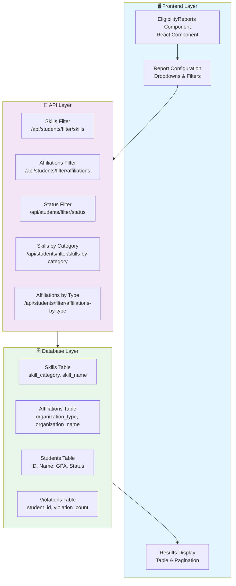

---

## Data Flow Diagrams

### 1. Initial Data Loading Flow

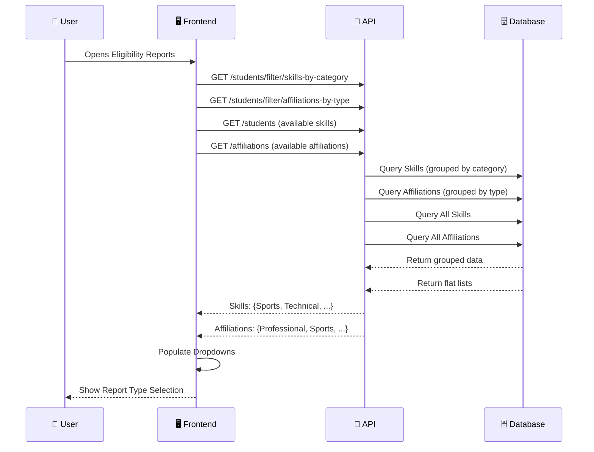

### 2. Report Generation Flow

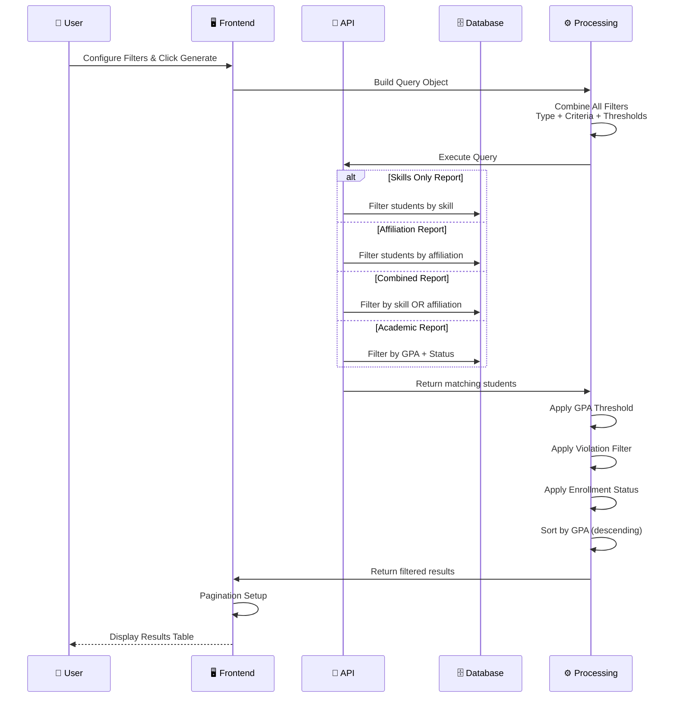

---

## Report Type Selection Logic

### Decision Tree for Report Types

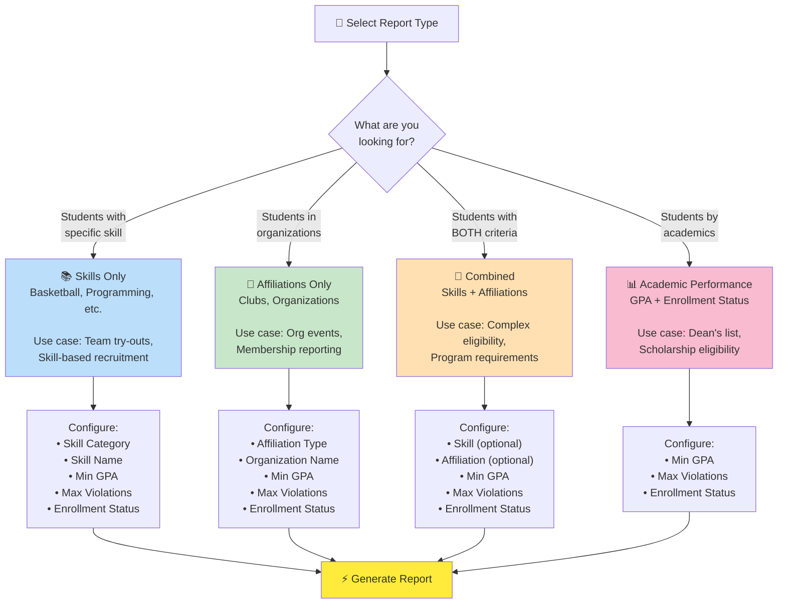

---

## Query Pipeline

### Filter Application Pipeline

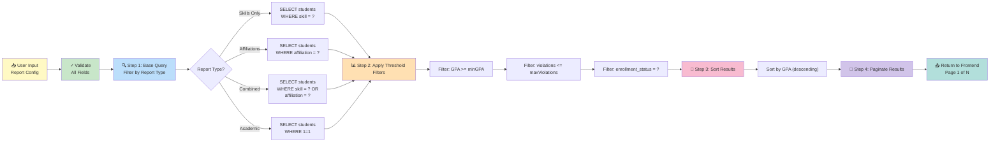

---

## Pre-built Query Templates

### Template Overview & Usage

```mermaid
graph TB
    subgraph Templates["🎯 Pre-built Query Templates"]
        T1["🏀 Basketball Try-outs"]
        T2["💻 Programming Contest"]
        T3["👔 Dean's List"]
    end
    
    subgraph Config1["Basketball Try-outs Config"]
        C1A["Report Type: Skills Only"]
        C1B["Skill: Basketball"]
        C1C["Min GPA: 0.00"]
        C1D["Max Violations: 10"]
        C1E["Status: Any"]
    end
    
    subgraph Config2["Programming Contest Config"]
        C2A["Report Type: Skills Only"]
        C2B["Skill: Programming"]
        C2C["Min GPA: 2.5"]
        C2D["Max Violations: 2"]
        C2E["Status: Enrolled/Regular"]
    end
    
    subgraph Config3["Dean's List Config"]
        C3A["Report Type: Academic"]
        C3B["No Skill Required"]
        C3C["Min GPA: 3.5"]
        C3D["Max Violations: 0"]
        C3E["Status: Enrolled"]
    end
    
    T1 -.->|One Click| C1A
    T2 -.->|One Click| C2A
    T3 -.->|One Click| C3A
    
    C1A & C1B & C1C & C1D & C1E -->|All filled| R1["🎯 Results: Active<br/>Basketball Players"]
    C2A & C2B & C2C & C2D & C2E -->|All filled| R2["🎯 Results: Qualified<br/>Programmers"]
    C3A & C3B & C3C & C3D & C3E -->|All filled| R3["🎯 Results: High-Performing<br/>Students"]
    
    style Templates fill:#fff9c4
    style C1A fill:#bbdefb
    style C2A fill:#c8e6c9
    style C3A fill:#f8bbd0
```

---

## Results Processing

### From Query Results to Display

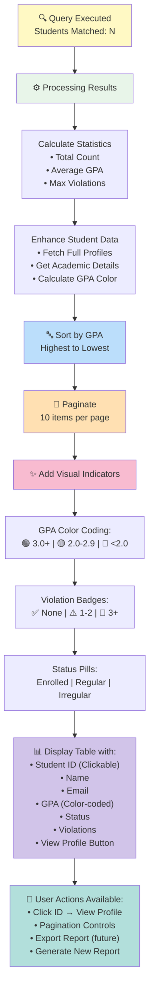

---

## Filter Combinations

### Supported Filter Combinations by Report Type

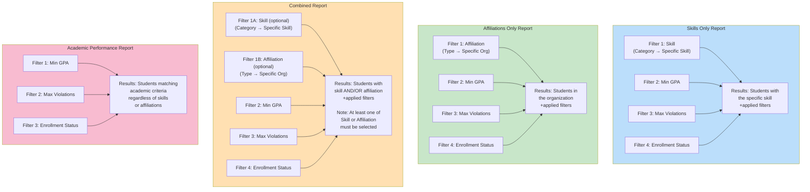

---

## Access Control

### Role-Based Access & Visibility

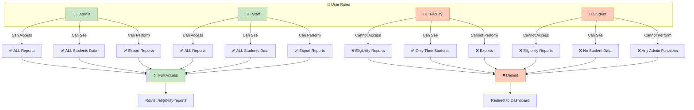

---

## Use Case Examples

### Use Case 1: Basketball Team Try-outs

```mermaid
graph LR
    Coach["👨‍🏫 Coaching Staff"] -->|Need| Need1["Find all eligible<br/>basketball players"]
    
    Need1 --> Step1["1️⃣ Open Eligibility Reports"]
    Step1 --> Step2["2️⃣ Click 'Basketball Try-outs'<br/>button"]
    Step2 --> Step3["3️⃣ Report auto-fills:<br/>• Skill: Basketball<br/>• Min GPA: 0<br/>• Max Violations: 10"]
    Step3 --> Step4["4️⃣ Click 'Generate Report'"]
    
    Step4 --> Process["⚙️ System processes:<br/>• Queries students with basketball skill<br/>• Filters by GPA & violations<br/>• Sorts by GPA descending"]
    
    Process --> Result["📊 Results: Table of<br/>45 basketball players<br/>sorted by academic standing"]
    
    Result --> Use1["✅ Coach reviews list"]
    Use1 --> Use2["✅ Click student ID<br/>to view full profile"]
    Use2 --> Use3["✅ Make team decisions<br/>based on complete info"]
    
    style Coach fill:#fff9c4
    style Need1 fill:#c8e6c9
    style Step1 fill:#bbdefb
    style Process fill:#ffe0b2
    style Result fill:#f8bbd0
```

### Use Case 2: Dean's List Eligibility

```mermaid
graph LR
    Admin["👨‍💼 Administrator"] -->|Need| Need2["Identify students for<br/>academic honors"]
    
    Need2 --> Step1["1️⃣ Open Eligibility Reports"]
    Step1 --> Step2["2️⃣ Click 'Dean's List'<br/>button"]
    Step2 --> Step3["3️⃣ Report auto-fills:<br/>• Min GPA: 3.5<br/>• Max Violations: 0<br/>• Status: Enrolled"]
    Step3 --> Step4["4️⃣ Click 'Generate Report'"]
    
    Step4 --> Process["⚙️ System processes:<br/>• Filters enrolled students<br/>• Min GPA 3.5+<br/>• Zero violations<br/>• Sorts by GPA"]
    
    Process --> Result["📊 Results: 156 eligible<br/>students for honors<br/>with GPA breakdown"]
    
    Result --> Use1["✅ Review honorees"]
    Use1 --> Use2["✅ Prepare honor cords"]
    Use2 --> Use3["✅ Send invitations"]
    
    style Admin fill:#fff9c4
    style Need2 fill:#c8e6c9
    style Step1 fill:#bbdefb
    style Process fill:#ffe0b2
    style Result fill:#f8bbd0
```

### Use Case 3: Programming Internship Program

```mermaid
graph LR
    HR["💼 HR Department"] -->|Need| Need3["Find interns for<br/>programming internships"]
    
    Need3 --> Step1["1️⃣ Open Eligibility Reports"]
    Step1 --> Step2["2️⃣ Select 'Combined'<br/>report type"]
    Step2 --> Step3["3️⃣ Configure:<br/>• Skill: Programming<br/>• Organization: Tech Club<br/>• Min GPA: 2.75<br/>• Max Violations: 1"]
    Step3 --> Step4["4️⃣ Click 'Generate Report'"]
    
    Step4 --> Process["⚙️ System processes:<br/>• Finds students with programming skill<br/>• In tech organizations<br/>• GPA 2.75+<br/>• Max 1 violation<br/>• Sorted by GPA"]
    
    Process --> Result["📊 Results: 23 qualified<br/>interns ready for<br/>placement"]
    
    Result --> Use1["✅ Review profiles"]
    Use1 --> Use2["✅ Schedule interviews"]
    Use2 --> Use3["✅ Place in internships"]
    
    style HR fill:#fff9c4
    style Need3 fill:#c8e6c9
    style Step1 fill:#bbdefb
    style Process fill:#ffe0b2
    style Result fill:#f8bbd0
```

---

## Query Examples with Visual Flow

### Example: Complex Multi-Criteria Query

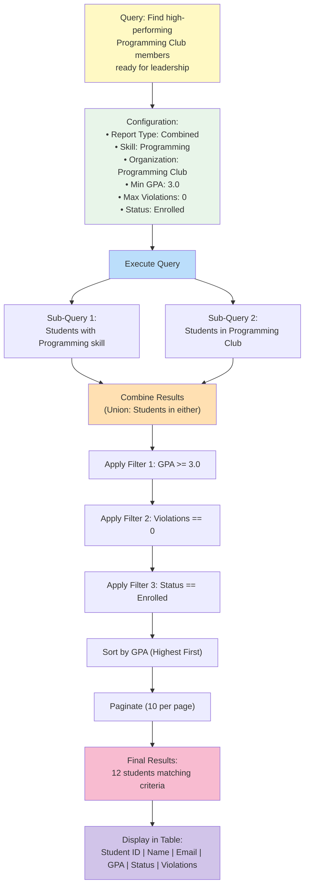

---

## Component Integration Architecture

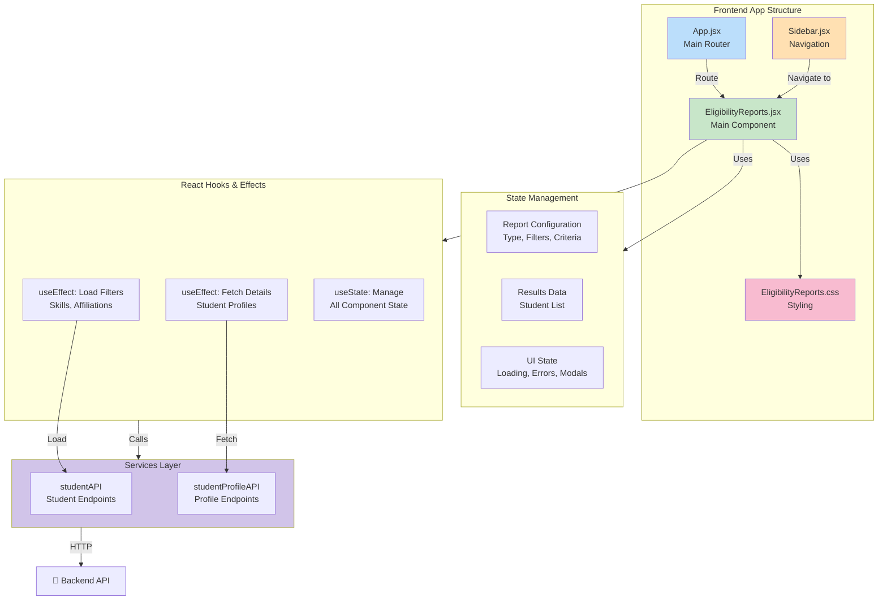

---

## Summary

### Key Metrics & Features

| Feature | Status | Details |
|---------|--------|---------|
| **Report Types** | ✅ 4 types | Skills, Affiliations, Combined, Academic |
| **Cascading Dropdowns** | ✅ Implemented | Category → Specific Item |
| **Filter Combinations** | ✅ All supported | GPA, Violations, Status |
| **Pre-built Templates** | ✅ 3 templates | Basketball, Programming, Dean's List |
| **Sorting** | ✅ By GPA | Highest to lowest |
| **Pagination** | ✅ 10 items/page | Full navigation controls |
| **Color Coding** | ✅ Visual indicators | GPA, Violations, Status |
| **Access Control** | ✅ Role-based | Admin & Staff only |
| **Performance** | ✅ Optimized | Grouped queries, efficient filtering |

### Data Flow Summary

```
User Input → Validation → Query Building → API Call → Database Query 
→ Result Processing → Sorting & Pagination → Visual Enhancement → Display
```

### System Reliability

- ✅ Error handling for API failures
- ✅ Loading states during processing
- ✅ Graceful fallbacks for missing data
- ✅ Modal dialogs for detailed views
- ✅ Console logging for debugging

---

**For more information, see:**
- [ELIGIBILITY_REPORTS_FEATURE.md](ELIGIBILITY_REPORTS_FEATURE.md)
- [ELIGIBILITY_REPORTS_IMPLEMENTATION.md](ELIGIBILITY_REPORTS_IMPLEMENTATION.md)
- [ELIGIBILITY_REPORTS_FIXES.md](ELIGIBILITY_REPORTS_FIXES.md)
