# Eligibility Reports - Results Visualization & Analytics Guide

**Date:** April 29, 2026  
**Purpose:** Best practices for interpreting and acting on eligibility report results

---

## 📊 Table of Contents

1. [Results Display Format](#results-display-format)
2. [Visual Indicators & Color Coding](#visual-indicators--color-coding)
3. [Interpreting Report Statistics](#interpreting-report-statistics)
4. [Report Analysis Workflows](#report-analysis-workflows)
5. [Data Quality Indicators](#data-quality-indicators)
6. [Export & Sharing](#export--sharing)

---

## Results Display Format

### Main Results Table Layout

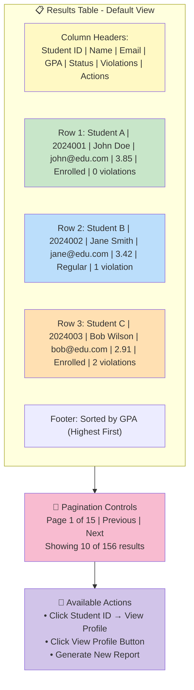

### Column Details

| Column | Data Type | Example | Purpose |
|--------|-----------|---------|---------|
| **Student ID** | Link/Badge | 2024001 | Click to view full student profile |
| **Name** | Text | John Doe | Student's full name |
| **Email** | Email | john@edu.com | Contact information |
| **GPA** | Decimal (Color) | 3.85 🟢 | Academic performance indicator |
| **Status** | Pill Badge | Enrolled | Enrollment status at snapshot time |
| **Violations** | Count Badge | 0 ✅ | Unresolved violations count |
| **Actions** | Button | View Profile | Additional details modal |

---

## Visual Indicators & Color Coding

### GPA Color Coding System

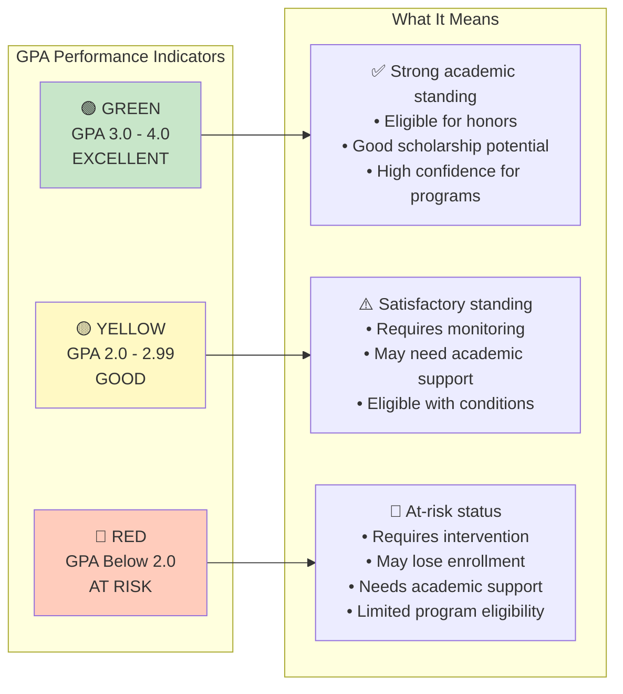

### Violations Badge System

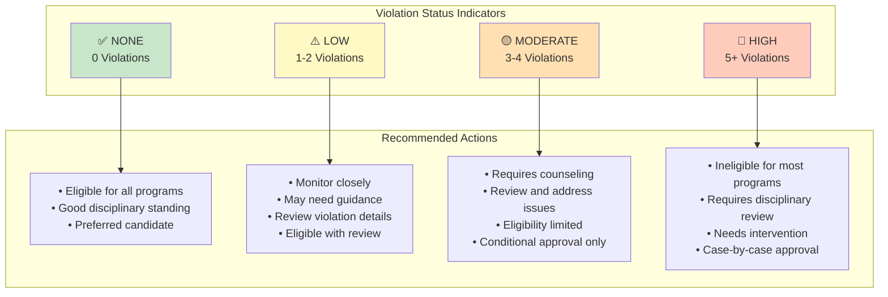

### Enrollment Status Pills

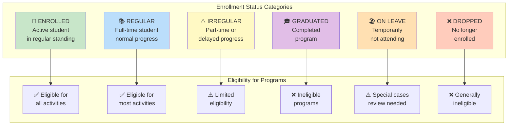

---

## Interpreting Report Statistics

### Quick Statistics Panel (Shown Above Results)

```mermaid
graph TB
    subgraph ReportMeta["📊 Report Metadata - Displayed at Top"]
        Title["Report Title:<br/>Skills Only - Basketball Players"]
        Generated["Generated: April 29, 2026 14:35:22"]
        Criteria["Criteria: Basketball Skill, GPA ≥ 0.0, Violations ≤ 10, Status: Any"]
    end
    
    subgraph Stats["📈 Quick Statistics"]
        Total["Total Results: 45 students"]
        Page["Current Page: 1 of 5 (10 per page)"]
        Avg["Average GPA: 3.12"]
        Distribution["GPA Distribution:<br/>🟢 28 High | 🟡 14 Mid | 🔴 3 Low"]
        Violations["Violation Stats:<br/>✅ 32 None | ⚠️ 10 Low | 🔴 3 High"]
    end
    
    subgraph Actions["🎯 Next Steps"]
        Review["Review top performers<br/>(GPA 3.5+)"]
        Contact["Contact selected students"]
        Profile["View detailed profiles"]
        NewReport["Generate new report<br/>with different criteria"]
    end
    
    ReportMeta --> Stats
    Stats --> Actions
    
    style Title fill=#fff9c4
    style Stats fill:#e8f5e9
    style Actions fill=#d1c4e9
```

### Data Distribution Analysis

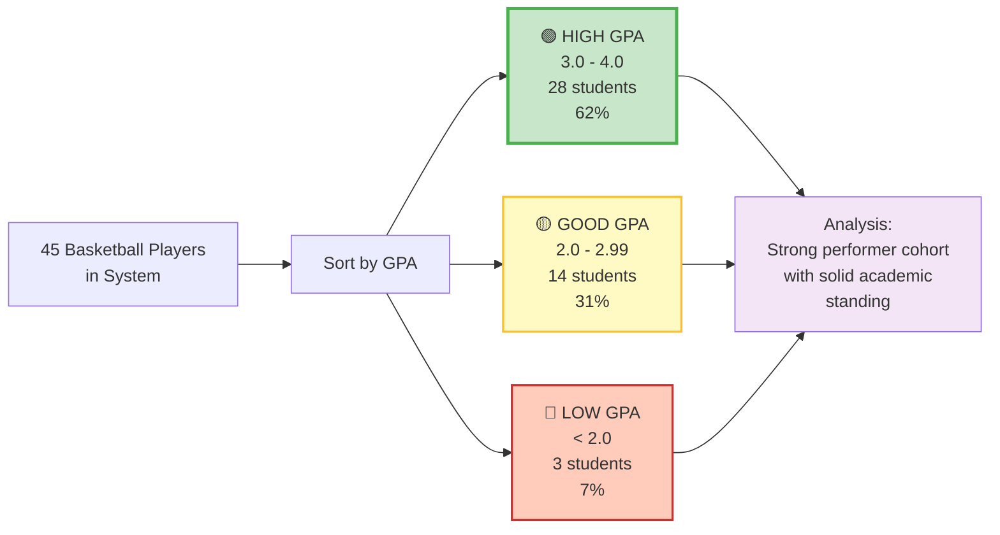

---

## Report Analysis Workflows

### Workflow 1: Identifying Top Performers

```mermaid
graph TD
    Start["📊 Generate Report:<br/>Dean's List Eligibility"]
    
    Start --> Step1["Step 1: Review Top 10<br/>Highest GPA scores"]
    Step1 --> Step2["Step 2: Check Violations<br/>All should be 0"]
    Step2 --> Step3["Step 3: Verify Status<br/>All should be Enrolled"]
    
    Step3 --> Quality["Step 4: Quality Check<br/>✅ All criteria met?"]
    
    Quality -->|Yes| Action1["✅ Proceed with:<br/>• Honor recognition<br/>• Scholarship offers<br/>• Leadership roles"]
    
    Quality -->|No| Review["🔍 Review anomalies<br/>Click student profile<br/>Investigate discrepancies"]
    
    Review --> Action2["Take action if needed:<br/>• Update records<br/>• Verify data<br/>• Contact student"]
    
    Action1 & Action2 --> End["✅ Complete Analysis"]
    
    style Start fill=#fff9c4
    style Step1 fill#bbdefb
    style Step2 fill#c8e6c9
    style Step3 fill#ffe0b2
    style Quality fill#f8bbd0
    style Action1 fill#c8e6c9
    style Review fill#ffccbc
    style End fill#d1c4e9
```

### Workflow 2: Filtering At-Risk Students

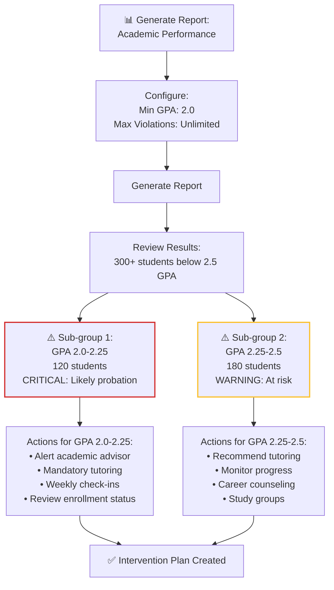

### Workflow 3: Program-Specific Recruitment

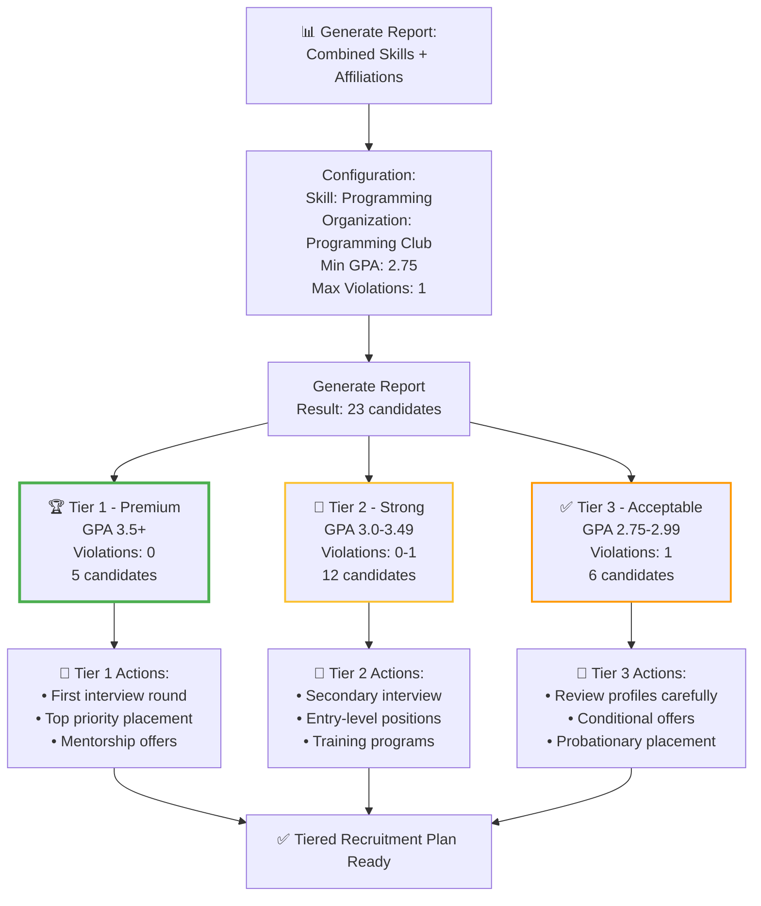

---

## Data Quality Indicators

### Result Validity Checklist

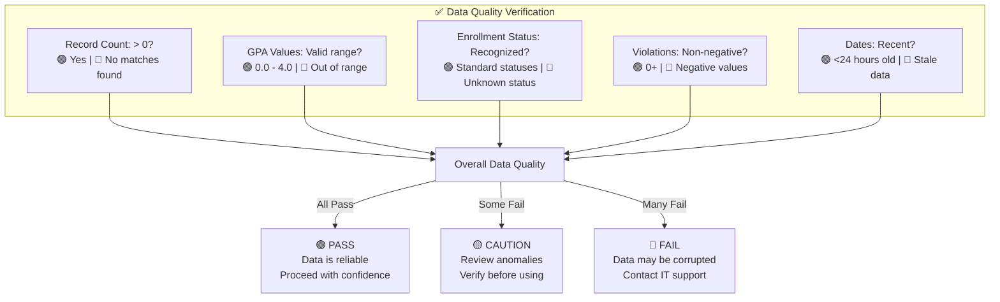

### Error Handling & Troubleshooting

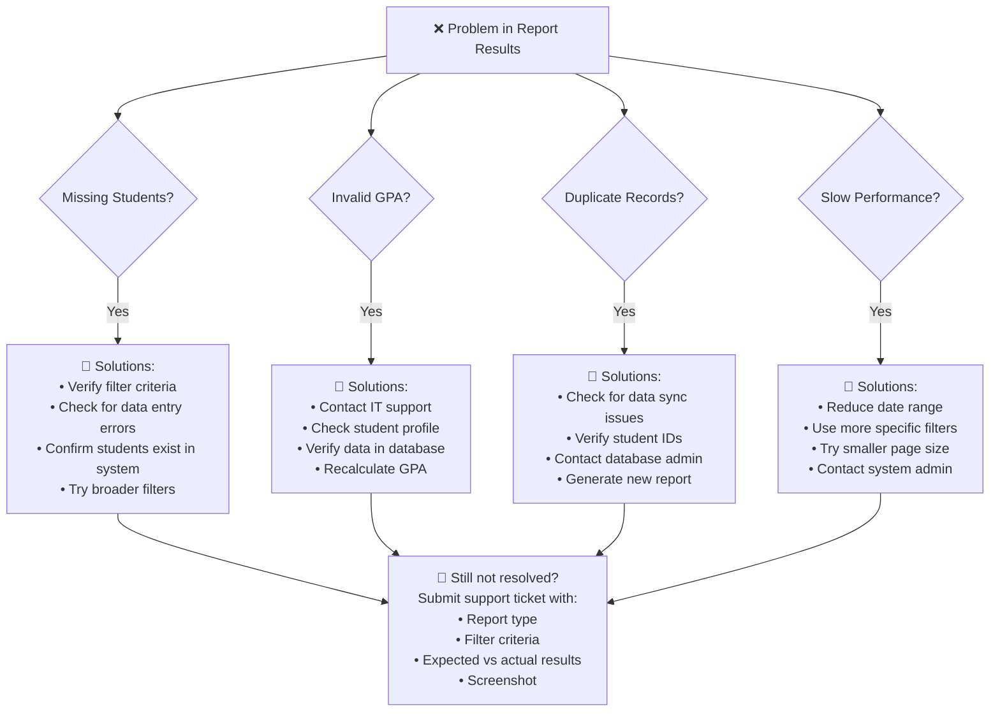

---

## Export & Sharing

### Report Export Workflow

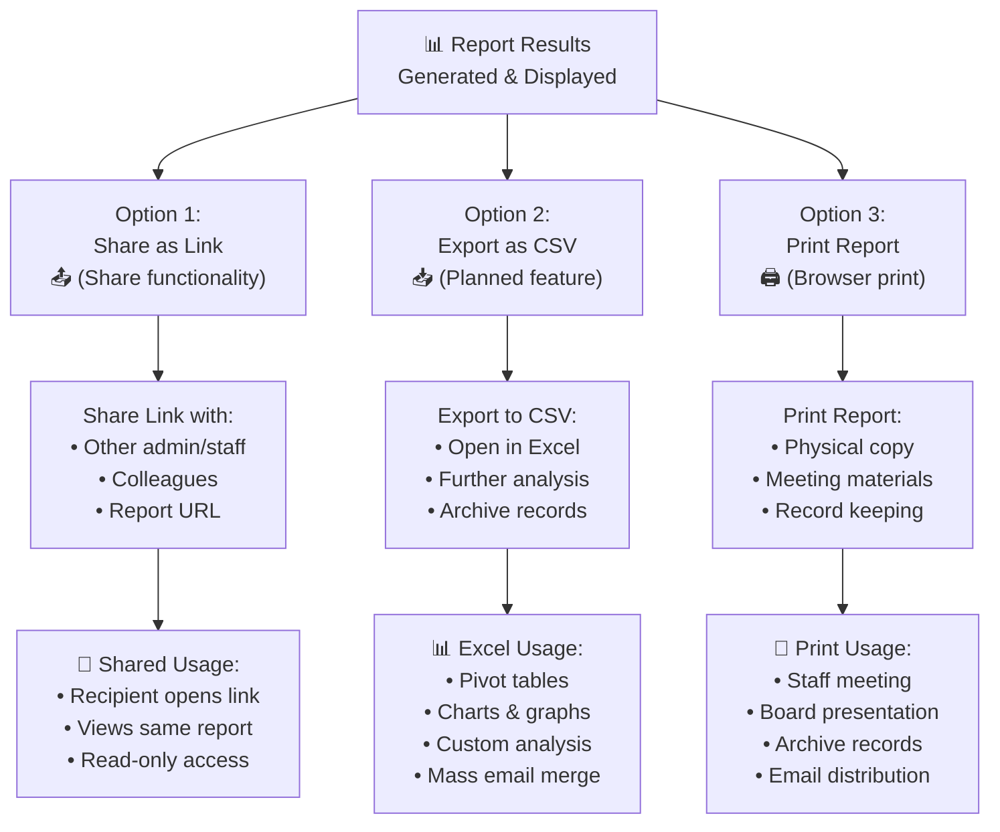

---

## Best Practices for Report Usage

### When to Generate Different Reports

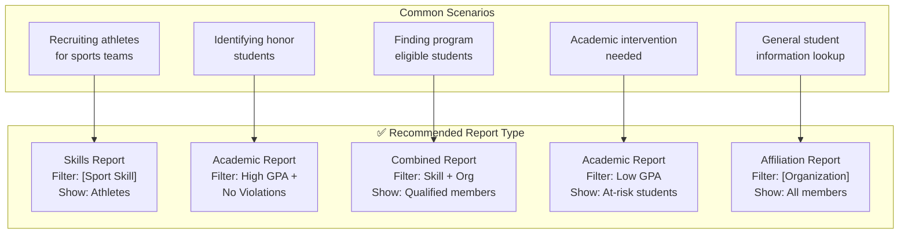

---

## Summary: Report Interpretation Guide

| Component | What to Look For | Action If Problem | Reference |
|-----------|------------------|-------------------|-----------|
| **Result Count** | > 0 records | Adjust filters, broaden criteria | Page 2 |
| **GPA Distribution** | 60%+ high GPA | Review at-risk cohort separately | Page 3 |
| **Violations** | Most students: 0-1 | Identify high-violation cases | Page 3 |
| **Status Mix** | Mostly Enrolled/Regular | Check graduation rates | Page 3 |
| **Data Currency** | < 24 hours old | Regenerate if stale | Page 5 |
| **Sorting** | Highest GPA first | Verify results organized correctly | Page 2 |

---

**For implementation details, see:** [ELIGIBILITY_REPORTS_ENHANCED_WITH_DIAGRAMS.md](ELIGIBILITY_REPORTS_ENHANCED_WITH_DIAGRAMS.md)
